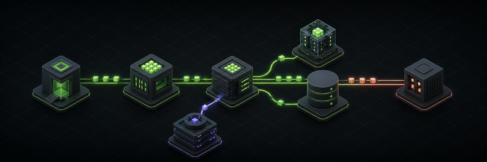

<div align="center">
  

  <h1>CodeTerrain</h1>

  <p>
    Explore landmark open-source codebases as interactive, source-linked architecture maps.
  </p>

  <p>
    
    
    
    
  </p>

  <p>
    <a href="#why-codeterrain">Why CodeTerrain</a> ·
    <a href="#explore-the-maps">Explore</a> ·
    <a href="#run-locally">Run locally</a> ·
    <a href="#add-or-update-a-map">Add a map</a>
  </p>
</div>

## Why CodeTerrain

Large repositories rarely have a single document that explains how a real
request moves through the system. CodeTerrain turns that journey into a map:
buildings represent subsystems, routes represent control and data flow, and
every explanation links back to the exact source file at the analyzed commit.

The library currently includes **66 maps across six domains**, from React,
Next.js, and VS Code to Linux, Kubernetes, PostgreSQL, Redis, llama.cpp, and
Unsloth.

| Explore | Understand | Verify |
| --- | --- | --- |
| Search by repository, language, category, or concept. | Follow curated journeys through control, data, and state changes. | Open commit-pinned citations without losing the map context. |
| Pan, zoom, filter routes, and enter fullscreen. | Select any building or route for its responsibility and payload. | Use the snapshot metadata to see exactly which revision was analyzed. |



## Explore the maps

Each repository has a durable `/repo/<slug>` page with a shared interactive
viewer. A map includes:

- **System orientation** — boundaries, districts, and the responsibility of
  each major component.
- **Curated journeys** — the important request or data paths to follow first.
- **Payloads and state** — what crosses each boundary and what changes along
  the way.
- **Source citations** — direct links to files at the mapped commit.
- **Glossary and learning path** — context for unfamiliar terms and a suggested
  reading order.

The catalog is statically generated for fast, shareable pages, while the shared
viewer keeps interaction and visual language consistent across every map.

## How a map becomes a page

```text
Repository metadata
        │
        ▼
Commit-pinned SystemMap data
        │
        ├── buildings: responsibilities + citations
        ├── routes: control/data/state + payloads
        └── journeys: curated reading paths
        │
        ▼
Static /repo/<slug> page → interactive viewer → exact source files
```

Map data is validated when it is loaded. The checks reject duplicate IDs,
unknown nodes or journey edges, out-of-bounds buildings, and missing source
citations before a broken map reaches production.

## Run locally

### Requirements

- Node.js 20.9 or newer
- pnpm 10 (the repository pins `pnpm@10.33.0`)

### Start the development server

```bash
pnpm install
pnpm dev
```

Open the URL printed by Next.js, usually
[http://localhost:3000](http://localhost:3000). If that port is occupied,
Next.js selects the next available port.

### Production checks

```bash
pnpm lint
pnpm build
```

## Project structure

```text
src/
├── app/                 # Library, map routes, metadata, and global styles
├── components/          # Catalog cards, controls, and the shared map viewer
├── data/maps/           # Commit-pinned architecture map definitions
└── lib/                 # Repository catalog, map types, and validation
public/                  # Static and social assets
docs/assets/             # README artwork
```

## Add or update a map

1. Add or update the repository metadata in
   [`src/lib/repositories.ts`](./src/lib/repositories.ts).
2. Add a `SystemMap` under [`src/data/maps`](./src/data/maps), including the
   analyzed branch, commit, and date.
3. Give every building and route at least one citation pinned to that commit.
4. Export the map from [`src/data/maps/index.ts`](./src/data/maps/index.ts).
5. Run `pnpm lint` and `pnpm build`.

Keep map copy explanatory rather than exhaustive: orient the reader, trace the
few paths that reveal the architecture, and let the citations carry them into
the implementation.

## Deploy to Vercel

Import the repository in Vercel and keep the detected Next.js defaults. Set
`NEXT_PUBLIC_SITE_URL` to the final production URL when using a custom domain;
otherwise the Vercel production host is detected automatically for canonical
URLs and social cards.
